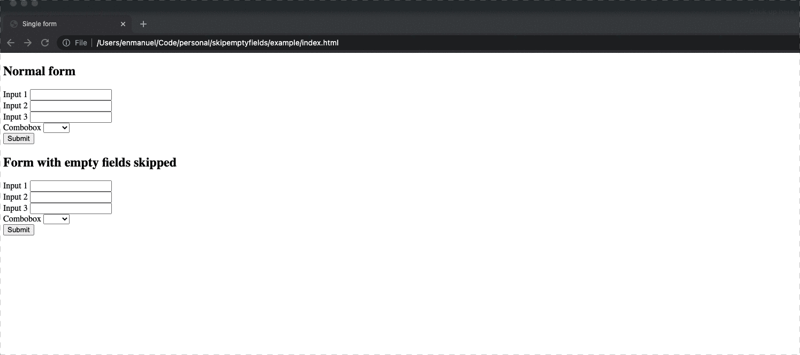

# Skip form empty fields submission

## What is this?

This is a script that makes it so your form doesn't submit the fields that are empty. 

Useful for filter forms if you have many fields but want the url to remain readable.

## Visual aids

